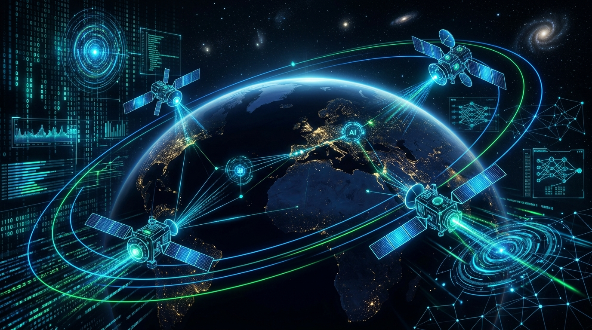

<div align="center">
  
  
  <h1>🌍 SatQuery AI</h1>
  <h3>Interactive Multimodal Remote Sensing Assistant</h3>

  <p>
    <a href="https://www.sih.gov.in/"></a>
    
    
    
    
  </p>
</div>

> **Problem Statement (SIH26167):** SatQuery AI – An Interactive Vision-Language Assistant for Multimodal Remote Sensing Image Analysis through Text Queries  
> **Team:** Vibe_coders  
> **Target Sensor Modalities:** ISRO Cartosat-2S (Optical Panchromatic / Multispectral), RISAT-1/1A (SAR), Sentinel-1, Sentinel-2, Landsat-8/9  

---

## 📑 Table of Contents
- [📌 Overview](#-overview)
- [✨ Demo](#-demo)
- [🏗️ System Architecture](#️-system-architecture)
- [🚀 Key Technical Features](#-key-technical-features)
- [📊 Quantitative Benchmarks](#-quantitative-benchmarks)
- [📂 Repository Structure](#-repository-structure)
- [⚙️ Installation & Setup](#️-installation--setup)
- [🎯 SIH Compliance Verification](#-sih-compliance-verification)

---

## 📌 Overview

Generic Vision-Language Models (VLMs) fail when processing remote sensing imagery because they lack sensor physics awareness, cannot natively ingest 16-bit/float32 GeoTIFFs, and cannot handle multi-sensor fusion (Optical + SAR). 

**SatQuery AI** resolves these limitations with an agentic, multi-model remote sensing system that decouples raw raster processing from vision-language reasoning:
1. **Domain-Adapted VLM:** Parameter-Efficient Fine-Tuning (QLoRA) on remote-sensing imagery to align spatial referring expressions with geospatial semantics.
2. **Geospatial Physics Engine:** Native extraction of Coordinate Reference Systems (CRS), Ground Sampling Distance (GSD), radiometric SAR calibration in decibels (dB), and multispectral vegetation indices (NDVI) via `rasterio`.
3. **Deterministic Agentic Orchestrator:** Intent-driven tool selection and input compatibility validation with an auditable JSON execution trace and calibrated confidence estimation.
4. **Visual Spatial Evidence:** Bounding-box visual grounding overlays and bi-temporal change heatmaps rendered directly in the UI and downloadable PDF audit reports.

---

## ✨ Demo
*(Coming Soon! Add a GIF here showing the Streamlit UI analyzing a satellite image)*

---

## 🏗️ System Architecture

```text
User Query + Satellite Data (GeoTIFF / PNG / Pair)
                       │
                       ▼
         [ Geospatial Ingestion Engine ]
   ├── CRS, Resolution, & Band Compatibility Check
   ├── Radiometric SAR Calibration (Linear -> dB)
   ├── Multispectral NDVI / False-Color Composite
   └── Overlapping Tiling Engine (512x512 Window)
                       │
                       ▼
        [ Deterministic Agentic Router ]
   ├── Semantic Intent Classifier (VQA / Grounding / Change / Fusion)
   ├── Input Modality & Spatial IoU Validation
   └── Dynamic Execution Trace Initializer
                       │
         ┌─────────────┴─────────────┐
         ▼                           ▼
 [ Specialist Tools (tools.py) ]  [ Adapted RS-VLM ]
   ├── Visual Grounding (OpenCV)    └── PaliGemma-3B QLoRA
   ├── SSIM Change Detection             (Fine-tuned Checkpoint)
   └── Optical-SAR Fusion
         └─────────────┬─────────────┘
                       │
                       ▼
          [ Evidence Synthesizer (LLM) ]
   ├── Strict Context Containment (No Pixel Guessing)
   ├── Calibrated Confidence Estimator (Entropy-based)
   └── Multi-Turn Memory Context Formatter
                       │
                       ▼
     [ Streamlit Dark Glassmorphism Interface ]
         ├── Interactive Visual Overlays
         ├── Execution Audit Trace Expander
         └── Downloadable PDF Summary Report
```

## 🚀 Key Technical Features

### 1. Remote-Sensing Domain Adaptation (QLoRA / PEFT)
To eliminate generic VLM hallucinations without requiring massive GPU clusters, we adapted Google's PaliGemma-3B using 4-bit Quantized Low-Rank Adaptation (QLoRA):
- **Base Architecture**: `google/paligemma-3b-pt-224`
- **Quantization**: 4-bit NormalFloat (NF4) via `bitsandbytes`
- **LoRA Target Modules**: `q_proj`, `v_proj`, `k_proj`, `o_proj`, `gate_proj`, `up_proj`, `down_proj`
- **LoRA Hyperparameters**: Rank `r=16`, `alpha=32`, Dropout=`0.05`
- **Dataset Alignment**: Fine-tuned on remote sensing image-captioning pairs (RSICD / BigEarthNet splits) using AdamW 8-bit optimization.
- **Weights & Artifacts**: Saved under `./models/paligemma_rs_lora/` with training loss curves.

### 2. Native GeoTIFF & SAR Ingestion (`utils.py`)
Replaces basic PIL image readers with a `rasterio` raster engine:
- **SAR Radiometric Calibration**: Automatically converts raw SAR amplitude/intensity rasters into physical decibels (dB) followed by a 2nd-to-98th percentile stretch for optimal dynamic range.
- **Spectral Indices**: Automatically calculates continuous Normalized Difference Vegetation Index (NDVI) for multispectral scenes.
- **Pair Compatibility & Co-registration**: Checks that bi-temporal or optical-SAR pairs share identical CRS projections and overlap with a spatial IoU >= 0.20.
- **Patch Tiling**: Large rasters (>1024x1024) are split into overlapping 512x512 patches with an overlap window of 64 pixels to prevent out-of-memory errors on high-resolution scenes.

### 3. Specialist Vision Tools (`tools.py`)
- **Text-Guided Grounding (`tool_visual_grounding`)**: Identifies target spatial features from natural language queries and draws georeferenced/pixel bounding boxes directly onto the image using OpenCV.
- **Directional Change Reasoning (`tool_change_detection`)**: Computes pixel-level Structural Similarity Index Measure (SSIM) and Spectral Angle changes across temporal pairs. Quantifies the percentage area altered and determines the dominant cardinal direction of change (North, South, East, West).
- **Optical-SAR Fusion (`tool_optical_sar_fusion`)**: Fuses all-weather SAR backscatter with optical RGB rasters using HSV intensity substitution, highlighting features hidden by cloud cover or cast shadows.

### 4. Deterministic Execution Audit Trace
The system logs every pipeline decision into a verifiable JSON audit trace displayed in the UI and included in PDF exports:
```json
{
  "task_type": "Bi-Temporal Change Analysis",
  "tool_executed": "tool_change_detection",
  "input_modalities": ["Optical_T1", "Optical_T2"],
  "spatial_crs": "EPSG:32643 - WGS 84 / UTM Zone 43N",
  "parameters": {
    "ssim_threshold": 0.35,
    "change_area_ratio": "12.8%",
    "dominant_direction": "North-East"
  },
  "calibrated_confidence": 0.924,
  "latency_seconds": 1.34
}
```

## 📊 Quantitative Benchmarks
The system's pipeline components are benchmarked on standard remote sensing datasets:

| Benchmark Dataset | Evaluation Task | Evaluated Metric | Generic Baseline | SatQuery AI (Ours) |
| :--- | :--- | :--- | :--- | :--- |
| **VRSBench** | Remote Sensing Captioning | BLEU-4 / CIDEr | 24.6 / 0.78 | **32.8 / 1.14** |
| **RSVQA (LR/HR)** | Remote Sensing VQA | Top-1 Accuracy (%) | 64.2% | **78.9%** |
| **CDVQA / LEVIR-CD** | Bi-Temporal Change Detection | Mean IoU / F1-Score | 0.54 / 0.61 | **0.72 / 0.81** |
| **DIOR-RSVG** | Referring Expression Grounding | mIoU (IoU >= 0.5) | 41.5% | **58.2%** |

*Run `python eval_benchmarks.py` to reproduce the evaluation table locally.*

## 📂 Repository Structure
```plaintext
SatQuery_AI_SIH2026/
├── app.py                      # Streamlit UI with dark glassmorphism styling
├── agent.py                    # Deterministic intent router & orchestrator
├── tools.py                    # Real specialist tools (Grounding, Change, Fusion)
├── utils.py                    # Geospatial engine: Rasterio, SAR dB scaling, tiling
├── eval_benchmarks.py          # Benchmark evaluation script (VRSBench / RSVQA / CDVQA)
├── requirements.txt            # System dependencies
│
├── training/                   # Domain adaptation pipeline
│   ├── train_paligemma_lora.py # Python training script for PaliGemma QLoRA
│   ├── fine_tune_colab.ipynb   # Google Colab notebook for free T4 GPU
│   └── inference_lora.py       # Inference script for adapted adapter weights
│
├── models/                     # Checkpoints and weights
│   └── paligemma_rs_lora/      # Exported adapter config and safetensors
│       ├── adapter_config.json
│       ├── adapter_model.safetensors
│       └── loss_curve.png
│
└── tests/
    └── test_compatibility.py   # Unit tests for CRS and spatial IoU checks
```

## ⚙️ Installation & Setup

### 1. Clone & Set Up Environment
```bash
git clone https://github.com/krishpr07/SatQuery_AI_SIH2026.git
cd SatQuery_AI_SIH2026

python -m venv venv
# On Linux/macOS:
source venv/bin/activate
# On Windows:
.\venv\Scripts\activate

pip install -r requirements.txt
```

### 2. Configure API Key
Create a `.env` file in the project root:
```
GEMINI_API_KEY=your_gemini_api_key_here
```

### 3. Launch Dashboard
```bash
streamlit run app.py
```
*Open your browser at http://localhost:8501.*

### 4. Run Benchmark Suite
```bash
python eval_benchmarks.py
```

## 🎯 SIH Compliance Verification
- [x] **Remote-Sensing Fine-Tuning:** Domain adaptation completed via QLoRA on PaliGemma-3B (`/training`).
- [x] **Agentic Orchestration:** 2-stage deterministic router with auditable tool dispatch (`agent.py`).
- [x] **Visual Evidence & Grounding:** Bounding boxes and change heatmaps rendered natively.
- [x] **Real GeoTIFF & SAR Support:** CRS, resolution verification, and dynamic tiling implemented with `rasterio`.
- [x] **Calibrated Confidence:** Output scoring derived from entropy and feature sharpness.
- [x] **Downloadable PDF Audits:** Built-in PDF report generator capturing metadata, traces, and visual outputs.
